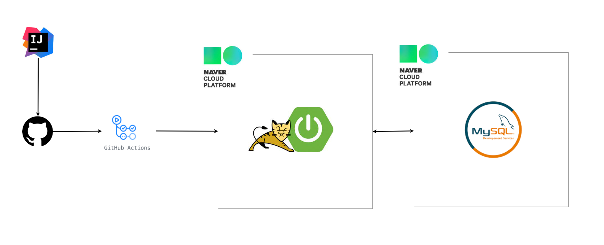
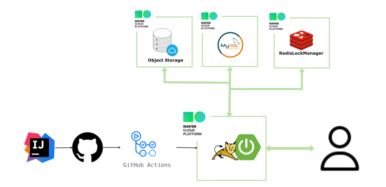
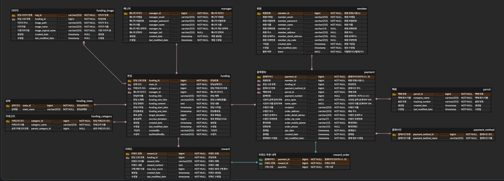
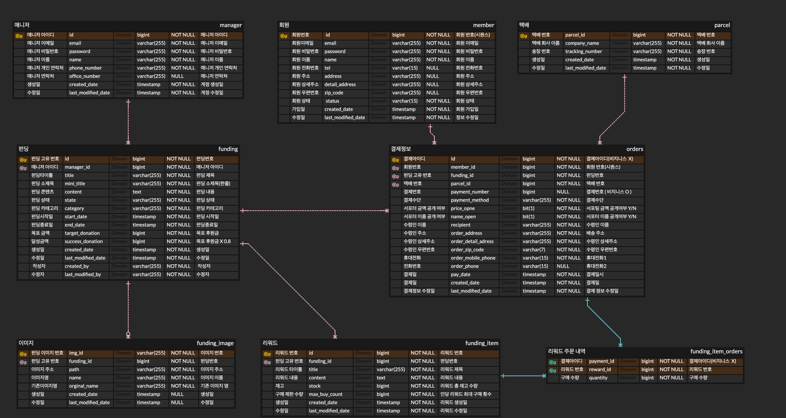
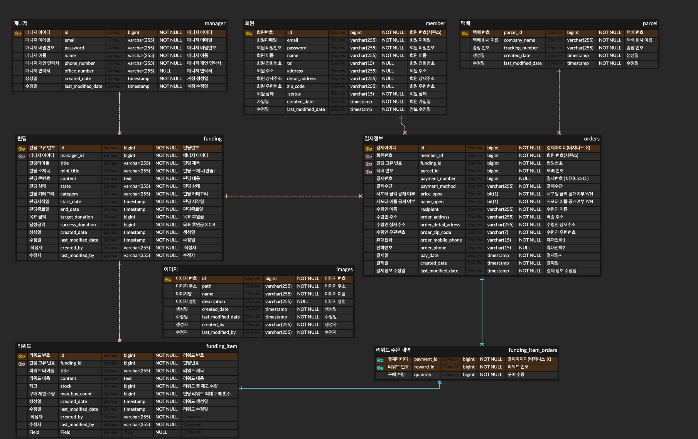
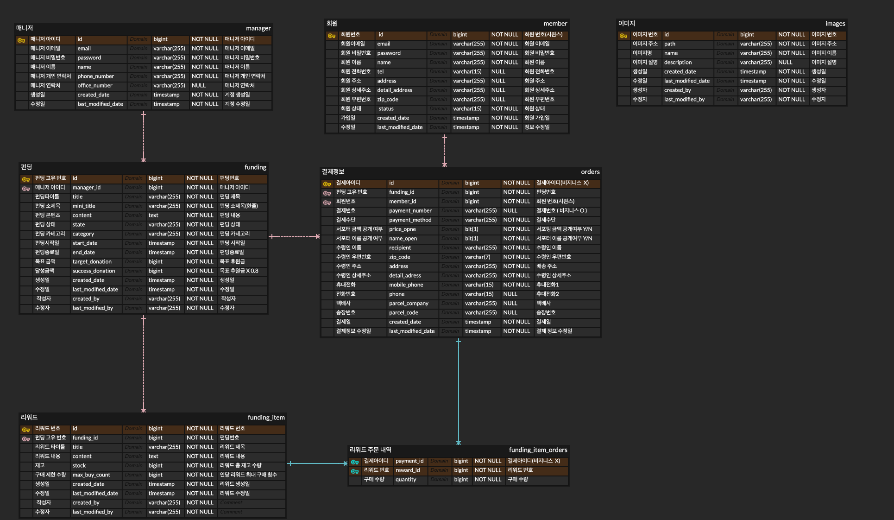

# 🐕petLink🐳

#### [Product Server](http://petlink.cloud/) : http://petlink.cloud/

#### [API Document](https://f-lab-edu.github.io/petLink/) : https://f-lab-edu.github.io/petLink/

🐾 petLink의 펀딩에 참여해  
반려동물의 후원금이 포한된 리워드 상품을 구매하여  
도움이 필요한 동물들에게 도움을 지원할 수 있습니다. 
함께 선한 영향력을 행사할 수 있는 기회를 제공합니다

-----

## 🔍 주요 관심사 🔍

- 기능 하나하나를 깊게 고민해서 완성도 있게 구현하는 경험
- 코드 리뷰를 통해 고품질의 코드를 작성하는 경험
- 대용량 트래픽을 발생시켜 경험하고 처리하는 경험
- 분산환경을 구축해보고 서비스간 연동해보는 경험
- 추후 확장 가능한 , 성장 가능한 서비스를 만드는 경험

-----

### 🖥️ 사용 기술 및 환경 🖥️

`JAVA 17`
`SpringBoot 3.0.5`
`MySql 8.0`
`JPA`
`QueryDSL`
`Redis`
`Object Storage`
`Docker`
`Github Actions`
`AWS`

----

### 🌐 서버 구조 🌐

v1 - 초기단계

v2 - Object Storage 신규 도입 

- Object Storage를 신규 도입

### 분산락 처리를 위한 Redis-server 도입

-----

### 💾 ERD 💾

[ERD LINK ](https://www.erdcloud.com/d/D6fkbZKiwQHX7kddG)

v1 - 초기단계

v2 - 테이블 개선 

v3 - 이미지 처리를 별도의 독립된 테이블로 구분하며 관리하기 위해 수정 

### v4 - 택배 정보를 Order 테이블에서 관리하도록 수정

